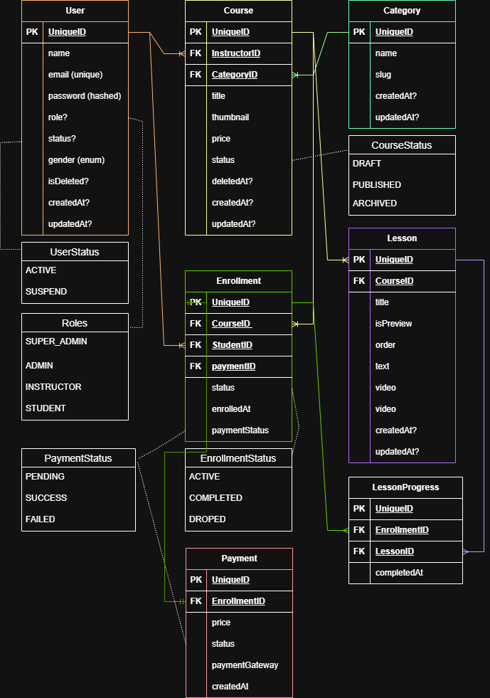

# Courstack — Learning Management System API

> A production-ready, SaaS-grade Learning Management System backend built with Node.js, TypeScript, Prisma ORM, and PostgreSQL. Designed with scalable architecture, clean module separation, and enterprise-level security.

---

## Table of Contents

- [Overview](#overview)
- [Tech Stack](#tech-stack)
- [Architecture](#architecture)
- [Database Schema](#database-schema)
- [Getting Started](#getting-started)
- [Environment Variables](#environment-variables)
- [API Reference](#api-reference)
- [Roles & Permissions](#roles--permissions)
- [Scripts](#scripts)
- [Project Structure](#project-structure)
- [License](#license)

---

## Overview

**Courstack** is a full-featured LMS backend that supports multiple user roles (Super Admin, Admin, Instructor, Student), course lifecycle management (Draft → Pending Review → Published → Archived), lesson progress tracking, enrollment with payment integration, and real-time stats — all behind a secure JWT-based authentication system with OTP verification.

### Key Capabilities

- Role-based access control (SUPER_ADMIN, ADMIN, INSTRUCTOR, STUDENT)
- Full course lifecycle: create, pending review, publish, archive, soft-delete
- Nested lesson management with video support and progress tracking
- Enrollment system with payment status tracking
- OTP-based email verification via Nodemailer
- Redis-backed session/token caching
- Cloudinary integration for media uploads
- Cron job support for scheduled tasks
- Zod-powered request validation

---

## Tech Stack

| Layer | Technology |
|---|---|
| Runtime | Node.js |
| Language | TypeScript |
| Framework | Express.js v5 |
| ORM | Prisma v7 |
| Database | PostgreSQL |
| Auth | JWT + OTP (Nodemailer) |
| Caching | Redis |
| Storage | Cloudinary |
| Validation | Zod |
| Package Manager | pnpm |

---

## Architecture

The project follows a **modular monolith** architecture where each domain is self-contained with its own controller, service, repository, routes, and validation layer.

```
src/
├── app/
│   ├── global/          # Global error handlers, response utilities
│   ├── helper/          # Shared helper functions
│   ├── middleware/       # Auth, role-guard, upload, error middleware
│   ├── modules/          # Domain modules (auth, user, course, etc.)
│   │   ├── auth/
│   │   │   ├── auth.controller.ts
│   │   │   ├── auth.repository.ts
│   │   │   ├── auth.routes.ts
│   │   │   ├── auth.service.ts
│   │   │   └── auth.validation.ts
│   │   ├── category/
│   │   ├── course/
│   │   ├── cron/
│   │   ├── enrollment/
│   │   ├── lesson/
│   │   ├── payment/
│   │   ├── stats/
│   │   └── user/
│   ├── routes/           # Root router aggregator
│   ├── schema/           # Prisma schema
│   ├── types/            # Shared TypeScript types
│   └── utils/            # Utility functions
├── generated/            # Prisma generated client
├── app.ts
└── server.ts
```

---

## Database Schema

The ERD reflects a normalized relational schema designed for production workloads.



### Entities

| Entity | Description |
|---|---|
| `User` | Supports roles: SUPER_ADMIN, ADMIN, INSTRUCTOR, STUDENT |
| `Course` | Belongs to an Instructor and a Category; supports DRAFT /PENDING_REVIEW / PUBLISHED / ARCHIVED statuses |
| `Lesson` | Nested under a Course; supports video content, ordering, and preview flags |
| `Enrollment` | Links a Student to a Course with payment tracking |
| `LessonProgress` | Tracks per-student lesson completion |
| `Payment` | Records payment gateway transactions tied to an Enrollment |
| `Category` | Categorizes courses via slug-based lookup |

---

## Getting Started

### Prerequisites

- Node.js >= 18
- pnpm >= 10
- PostgreSQL (running locally)
- Redis (running locally)

### Installation

```bash
# Clone the repository
git clone https://github.com/Sushanto171/courstack-backend
cd courstack-backend

# Install dependencies
pnpm install

# Set up environment variables
cp .env.example .env
# Fill in the required values in .env

# Run database migrations
pnpm migrate

# Start development server
pnpm dev
```

The server will start at `http://localhost:<PORT>` as configured in your `.env`.

---

## Environment Variables

Copy `.env.example` to `.env` and fill in the values:

```env
# Server
PORT=

# Database
DATABASE_URL=

# JWT
JWT_ACCESS_SECRET=
JWT_REFRESH_SECRET=
JWT_ACCESS_EXPIRES_IN=
JWT_REFRESH_EXPIRES_IN=

# Redis
REDIS_URL=

# Email (Nodemailer)
SMTP_HOST=
SMTP_PORT=
SMTP_USER=
SMTP_PASS=

# Cloudinary
CLOUDINARY_CLOUD_NAME=
CLOUDINARY_API_KEY=
CLOUDINARY_API_SECRET=

# Super Admin Seed
SUPER_ADMIN_EMAIL=
SUPER_ADMIN_PASSWORD=
```

---


### Live Demo & Test Credentials

**Base URL:** `https://courstakc-backend.vercel.app`

> ⚠️ These credentials are for demo and testing purposes only. Do not use them for any production or sensitive operations.

| Role | Email | Password |
|---|---|---|
| 🔴 Super Admin | `superadmin@courstack.com` | `SuperSecret123!` |
| 🟠 Admin | `admin@courstack.com` | `Admin@11` |
| 🟡 Instructor | `instructor@courstack.com` | `Instructor@1` |
| 🟢 Student | `student@courstack.com` | `Student@1` |

### Quick Test Flow

```bash
# 1. Login with any test account
POST https://courstack-backend.vercel.app/api/v1/auth/login
{
  "email": "student@courstack.com",
  "password": "Student@1"
}

# 2. Verify OTP if required
POST https://courstack-backend.vercel.app/api/v1/auth/verify
{
  "otp": "<otp_from_email> or 123456 (only for test)"
}
```

## API Reference

Base URL: `{{local}}` (configurable via Postman environment)

A complete Postman collection is included in the repository: `courstack.postman_collection.json`

### Auth — `/auth`

| Method | Endpoint | Description | Auth |
|---|---|---|---|
| POST | `/auth/login` | Login with email & password | Public |
| POST | `/auth/verify` | Verify OTP to activate session | Public |
| GET | `/auth/me` | Get authenticated user profile | Required |
| GET | `/auth/get-otp` | Resend OTP | Required |
| GET | `/auth/refresh` | Refresh access token | Required |

---

### User — `/user`

| Method | Endpoint | Description | Auth |
|---|---|---|---|
| GET | `/user` | Get all users (supports `?search=`) | Admin |
| POST | `/user` | Create a new user (INSTRUCTOR / STUDENT) | Admin |
| POST | `/user/create-admin` | Create an Admin user | Super Admin |
| PATCH | `/user/update-status` | Suspend or reactivate a user | Admin |
| PATCH | `/user/:id` | Update user profile | Owner / Admin |

---

### Category — `/category`

| Method | Endpoint | Description | Auth |
|---|---|---|---|
| GET | `/category` | Get all categories | Public |
| GET | `/category/:slug` | Get category by slug | Public |
| POST | `/category` | Create a category | Admin |
| PATCH | `/category/:id` | Update a category | Admin |

---

### Course — `/course`

| Method | Endpoint | Description | Auth |
|---|---|---|---|
| GET | `/course` | Get all courses (supports query filters) | Public |
| GET | `/course/:slug` | Get course by slug | Public |
| GET | `/course/my-courses` | Get instructor's own courses | Instructor |
| POST | `/course` | Create a course | Instructor |
| PATCH | `/course/:id` | Update course details | Instructor |
| PATCH | `/course/status/:id` | Update course status | Instructor / Admin |
| DELETE | `/course/soft/:id` | Soft delete a course | Instructor / Admin |

**Course query parameters:**

| Param | Values | Description |
|---|---|---|
| `status` | `DRAFT`, `PUBLISHED` | Filter by status |
| `limit` | number | Limit result count |
| `order` | `asc`, `desc` | Sort order |

---

### Lesson — `/course/:courseId/lessons`

| Method | Endpoint | Description | Auth |
|---|---|---|---|
| GET | `/course/:courseId/lessons` | Get all lessons overview | Enrolled / Instructor |
| GET | `/course/:courseId/lessons/:lessonId` | Get single lesson with content | Enrolled / Instructor |
| POST | `/course/:courseId/lessons` | Add a lesson | Instructor |
| PATCH | `/course/:courseId/lessons/:lessonId` | Update lesson (incl. videos) | Instructor |
| PATCH | `/course/:courseId/lessons/:lessonId/status` | Update lesson status | Instructor |
| POST | `/course/:courseId/lessons/:lessonId/progress` | Mark lesson as complete | Student |

---

### Enrollment — `/enrollment`

| Method | Endpoint | Description | Auth |
|---|---|---|---|
| POST | `/enrollment` | Enroll in a course | Student |
| GET | `/enrollment/my-enrollments` | Get own enrollments | Student |
| GET | `/enrollment/:courseId` | Get all enrollments for a course | Instructor / Admin |

---

### Stats — `/stats`

| Method | Endpoint | Description | Auth |
|---|---|---|---|
| GET | `/stats` | Get platform-wide statistics | All Roles |

---

## Roles & Permissions

| Action | SUPER_ADMIN | ADMIN | INSTRUCTOR | STUDENT |
|---|:---:|:---:|:---:|:---:|
| Create Admin | ✅ | ❌ | ❌ | ❌ |
| Manage Users | ✅ | ✅ | ❌ | ❌ |
| Create Course | ✅ | ✅ | ✅ | ❌ |
| Publish Course | ✅ | ✅ | ✅ | ❌ |
| Enroll in Course | ❌ | ❌ | ❌ | ✅ |
| Track Progress | ❌ | ❌ | ❌ | ✅ |
| View Stats | ✅ | ✅ | ✅ | ✅ |

---

## Scripts

```bash
pnpm dev           # Start development server with hot reload (tsx watch)
pnpm build         # Generate Prisma client and compile TypeScript
pnpm start         # Run compiled production build
pnpm migrate       # Run Prisma migrations
pnpm generate      # Regenerate Prisma client
pnpm lint          # Run ESLint on /src
```

---

## Project Structure

```
courstack-backend/
├── src/
│   ├── app/
│   │   ├── global/
│   │   ├── helper/
│   │   ├── middleware/
│   │   ├── modules/
│   │   │   ├── auth/
│   │   │   ├── category/
│   │   │   ├── course/
│   │   │   ├── cron/
│   │   │   ├── enrollment/
│   │   │   ├── lesson/
│   │   │   ├── payment/
│   │   │   ├── stats/
│   │   │   └── user/
│   │   ├── routes/
│   │   ├── schema/
│   │   ├── types/
│   │   └── utils/
│   ├── generated/
│   ├── app.ts
│   └── server.ts
├── .env.example
├── .gitignore
├── courstack.postman_collection.json
├── courstack_drawio.png
├── package.json
├── prisma/
│   └── schema.prisma
├── tsconfig.json
└── README.md
```

---

## License

This project is licensed under the ISC License.

---

> Built with ❤️ as a production-grade SaaS backend demonstrating advanced full-stack engineering, clean architecture, and real-world design patterns.
